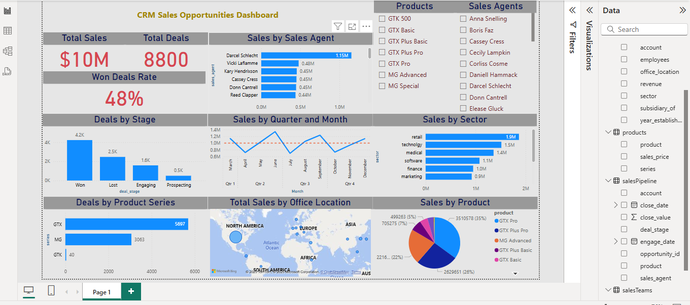

# CRM-Opportunities-Sales-Dashboard
Dashboard project for CRM Opportunities Sales analysis using Power BI

# CRM Opportunities Sales Dashboard – Power BI Project

- This project presents a CRM sales opportunities dashboard built using Power BI to analyze deal performance, product trends, and regional sales activities.

### Overview

The dashboard provides clear insights into:

- Total sales value and number of deals

- Win rate analysis

- Sales by sales agents and office locations

- Deals by stage, sector, and product series

- Monthly and quarterly sales trends

- Interactive filtering by products and agents

### Key Features

- Data model created and optimized in Power BI

- Data cleaned and transformed using Power Query

- Relationships established between multiple tables (sales pipeline, products, teams, etc.)

- Custom DAX measures for KPIs like Win Rate

- Advanced visualizations: column charts, pie charts, map, and line charts

### Tools Used
- Power BI

- Power Query

- DAX

- Data Modeling

### Insights

- Total sales reached $10M, with 8800 total deals recorded.

- The Win Deals Rate stands at 48%, indicating room for pipeline improvement.

- The majority of closed deals were at the "Won" stage (4.2K), followed by "Lost" (2.5K).

- Retail and Technology were the top-performing sectors, generating the highest revenue.

- Darcel Schlecht led the sales team with $1.15M in closed deals.

- Most sales were concentrated in North America, followed by Europe and Asia.

- GTX Pro was the best-selling product, contributing 35% of total sales.

### Dashboard

Author
Mohammad Anwar – Data Analyst 

